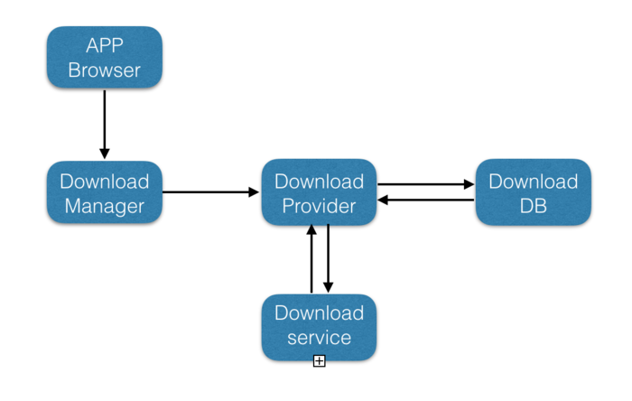

# Download 模块分析(一)

> 本文分析 DownloadManager 下载文件的流程。

### DownloadManager 下载流程

#### 基本用法

``` java
Uri uri = Uri.parse("your own uri");
        DownloadManager.Request mRequest = new DownloadManager.Request(uri);
        DownloadManager manager = (DownloadManager) getSystemService(Context.DOWNLOAD_SERVICE);
        if (manager != null) {
            // 自动开始下载任务
            manager.enqueue(mRequest);
        }
```
调用`enqueue`方法之后，只要数据连接可用并且 `DownloadManager` 可用，下载就会自动开始。

#### 流程分析

**DownloadManager.java**

`DownloadManager.enqueue()`：
``` java
public long enqueue(Request request) {
        ContentValues values = request.toContentValues(mPackageName);
        Uri downloadUri = mResolver.insert(Downloads.Impl.CONTENT_URI, values);
        long id = Long.parseLong(downloadUri.getLastPathSegment());
        return id;
    }
```
其中`request.toContentValues()`会将`Request`类中的属性写入到 `ContentValues`当中，最后将该记录写入到`Downloads.Impl.CONTENT_URI`所在数据库当中。

查看 `DownloadProvider.insert()`:

``` java
    public Uri insert(final Uri uri, final ContentValues values) {
        //...
        final long token = Binder.clearCallingIdentity();
        try {
            Helpers.scheduleJob(getContext(), rowID);
        } finally {
            Binder.restoreCallingIdentity(token);
        }
        //...
        return ContentUris.withAppendedId(Downloads.Impl.CONTENT_URI, rowID);
    }
```
此处过滤了`insert()`中大部分操作下载数据库字段的不相关代码。之前的版本中，`DownloadProvider`通过`context.startService()`启动`DownloadService`。在 Android N 版本之后，`DownloadProvider`引入了`JobScheduler`进行异步下载任务的处理。而且`JobScheduler`可以在设备达到某些条件（如连接充电器、在WiFi环境下等）才执行任务，可以节省用户设备的资源。

**Helpers.java**

`Helpers`类是控制异步任务下载的一个工具类，查看`Helpers.scheduleJob()`:
``` java
    public static void scheduleJob(Context context, long downloadId) {
        final boolean scheduled = scheduleJob(context,
                DownloadInfo.queryDownloadInfo(context, downloadId));
        if (!scheduled) {
            // If we didn't schedule a future job, kick off a notification
            // update pass immediately
            getDownloadNotifier(context).update();
        }
    }
```
其中`Helpers.scheduleJob()`方法中使用`rowId`将那条下载信息查询出来，然后调用绑定的`DownloadJobService`进行下载任务。如果线程调度失败，会返回`false`。`getDownloadNotifier(context).update()`和更改通知栏 UI 相关，不进行详述。

`scheduleJob()`中设置了`JobScheduler`的相关属性：
``` java
    public static boolean scheduleJob(Context context, DownloadInfo info) {
        //...
        final JobInfo.Builder builder = new JobInfo.Builder(jobId,
                new ComponentName(context, DownloadJobService.class));
        //...
        scheduler.scheduleAsPackage(builder.build(), packageName, UserHandle.myUserId(), TAG);
        return true;
    }
```
**DownloadJobService.java**

下载任务通过`DownloadJobService`进行调度，`onStartJob()`中开始下载:
``` java
    public boolean onStartJob(JobParameters params) {
        final int id = params.getJobId();
        // Spin up thread to handle this download
        final DownloadInfo info = DownloadInfo.queryDownloadInfo(this, id);
        //...
        final DownloadThread thread;
        synchronized (mActiveThreads) {
            thread = new DownloadThread(this, params, info);
            mActiveThreads.put(id, thread);
        }
        thread.start();
        return true;
    }
```
**DownloadThread.java**

`DownloadThread`的`run()`方法中。核心下载方法为`executeDonwload()`：
``` java
    private void executeDownload() throws StopRequestException {
        final boolean resuming = mInfoDelta.mCurrentBytes != 
        //...
        int redirectionCount = 0;
        while (redirectionCount++ < Constants.MAX_REDIRECTS) {
            if ((!cleartextTrafficPermitted) && ("http".equalsIgnoreCase(url.getProtocol()))) {
                throw new StopRequestException(STATUS_BAD_REQUEST,
                        "Cleartext traffic not permitted for UID " + mInfo.mUid + ": "
                                + Uri.parse(url.toString()).toSafeString());
            }
            HttpURLConnection conn = null;
            try {
                //...
                conn = (HttpURLConnection) mNetwork.openConnection(url);
                //...
                addRequestHeaders(conn, resuming);
                final int responseCode = conn.getResponseCode();
                switch (responseCode) {
                    case HTTP_OK:
                        if (resuming) {
                            throw new StopRequestException(
                                    STATUS_CANNOT_RESUME, "Expected partial, but received OK");
                        }
                        parseOkHeaders(conn);
                        transferData(conn);
                        return;

                    case HTTP_PARTIAL:
                        if (!resuming) {
                            throw new StopRequestException(
                                    STATUS_CANNOT_RESUME, "Expected OK, but received partial");
                        }
                        transferData(conn);
                        return;
                    case HTTP_MOVED_PERM:
                    case HTTP_MOVED_TEMP:
                    case HTTP_SEE_OTHER:
                    case HTTP_TEMP_REDIRECT:
                        final String location = conn.getHeaderField("Location");
                        url = new URL(url, location);
                        if (responseCode == HTTP_MOVED_PERM) {
                            // Push updated URL back to database
                            mInfoDelta.mUri = url.toString();
                        }
                        continue;
                    //...
                }
            //...
        }
        throw new StopRequestException(STATUS_TOO_MANY_REDIRECTS, "Too many redirects");
    }
```

以上代码分为几部分进行分析。

**重定向**：

> 理想情况下，一项资源只有一个访问位置，也就是只有一个 URL 。但是由于种种原因，需要为资源设定不同的名称（即不同的域名，例如带有和不带有www 前缀的URL，以及简短易记的 URL 等）。在这种情况下，实用的方法是将其重定向到那个实际的（标准的）URL，而不是复制资源。
> 
> HTTP 版本站点的请求会被重定向至采用了 HTTPS 协议的版本。
``` java
if ((!cleartextTrafficPermitted) && ("http".equalsIgnoreCase(url.getProtocol()))) {
                throw new StopRequestException(STATUS_BAD_REQUEST,
                        "Cleartext traffic not permitted for UID " + mInfo.mUid + ": "
                                + Uri.parse(url.toString()).toSafeString());
            }
```

首先需要传输用户 `UID`。用户 `UID` 强制使用明码传输，因此不能使用 `HTTPS` 协议传输。因为 `HTTP` 重定向过程中可能会切换到 `HTTPS` 协议。

**`HTTP` 请求头：**

``` java
    private void addRequestHeaders(HttpURLConnection conn, boolean resuming) {
        //...
        conn.setRequestProperty("Accept-Encoding", "identity");
        conn.setRequestProperty("Connection", "close");

        if (resuming) {
            if (mInfoDelta.mETag != null) {
                conn.addRequestProperty("If-Match", mInfoDelta.mETag);
            }
            conn.addRequestProperty("Range", "bytes=" + mInfoDelta.mCurrentBytes + "-");
        }
    }
 ```
`addRequestHeaders()`方法中的第二个参数`resuming`表示当前下载任务是否需要继续下载，即当前任务处于暂停状态。
可以通过从数据库查询相应下载任务已写入文件字节数，若不为`0`则表示需要继续下载。

**请求头中相关字段介绍：**

-  `Accept-Encoding`: 客户端能够理解的内容编码方式。`identity`表示不使用任何压缩算法进行编码。    
-  `Connection`: 决定当前的事务完成后，是否会关闭网络连接。`close`表示任务完成后关闭连接。    
-  `If-Match`：`HTTP`缓存相关字段，表示一个条件请求。在请求方法为 `GET` 和 `HEAD` 的情况下，服务器仅在请求的资源满足此首部列出的 `ETag` 之一时才会返回资源。`value`为`ETag`值。    
-  `Range`: 告知服务器请求返回文件的哪一部分。`value`为请求文件比特数的范围。

**`HTTP` 响应：**

``` java
    switch (responseCode) {
                    case HTTP_OK:
                        if (resuming) {
                            throw new StopRequestException(
                                    STATUS_CANNOT_RESUME, "Expected partial, but received OK");
                        }
                        parseOkHeaders(conn);
                        transferData(conn);
                        return;
                    case HTTP_PARTIAL:
                        if (!resuming) {
                            throw new StopRequestException(
                                    STATUS_CANNOT_RESUME, "Expected OK, but received partial");
                        }
                        transferData(conn);
                        return;
                    case HTTP_MOVED_PERM:
                    case HTTP_MOVED_TEMP:
                    case HTTP_SEE_OTHER:
                    case HTTP_TEMP_REDIRECT:
                        final String location = conn.getHeaderField("Location");
                        url = new URL(url, location);
                        if (responseCode == HTTP_MOVED_PERM) {
                            // Push updated URL back to database
                            mInfoDelta.mUri = url.toString();
                        }
                        continue;
                    //...
                }
```
**下载任务相关 `HTTP` [状态码](https://developer.mozilla.org/zh-CN/docs/Web/HTTP/Redirections)：**
- `HTTP_OK`: 200。表示请求成功
- `HTTP_PARTIAL`: 206。成功状态响应代码表示请求已成功，并且主体包含所请求的数据区间，该数据区间是在请求的 `Range` 首部指定的。
-  `HTTP_MOVED_PERM`: 301。`URL` 永久重定向，`GET` 方法不会发生变更，其他方法有可能会变更为 `GET` 方法。
-  `HTTP_MOVED_TEMP`: 302。`URL`临时重定向，	`GET` 方法不会发生变更，其他方法有可能会变更为 `GET` 方法。
-  `HTTP_SEE_OTHER`: 303。`URL`临时重定向，`GET` 方法不会发生变更，其他方法会变更为 `GET` 方法（消息主体会丢失）。
-  `HTTP_TEMP_REDIRECT`307。`URL`临时重定向，方法和消息主体都不发生变化。

重定向相关状态码处理方式一致。

1. 首先看请求成功的流程：
``` java
    private void parseOkHeaders(HttpURLConnection conn) throws StopRequestException {
        if (mInfoDelta.mFileName == null) {
            // ...
            try {
                mInfoDelta.mFileName = Helpers.generateSaveFile(mContext, mInfoDelta.mUri,
                        mInfo.mHint, contentDisposition, contentLocation, mInfoDelta.mMimeType,
                        mInfo.mDestination);
            }
            //...
        }
        //...
        mInfoDelta.writeToDatabaseOrThrow();
    }
```
首先来看请求成功的情况。`parseOkHeaders()`解析响应头中的不同字段，并且存到内部类`DownloadInfoDelta`当中。`Helps.generateSaveFile()`生成下载相关文件。`writeToDatabaseOrThrow()`则通过`DownloadProvider.update()`将任务下载到数据库当中。

查看`transferData()`代码：
``` java
    private void transferData(HttpURLConnection conn) throws StopRequestException {
        //...
        try {
            //...
            try {
                outPfd = mContext.getContentResolver()
                        .openFileDescriptor(mInfo.getAllDownloadsUri(), "rw");
                outFd = outPfd.getFileDescriptor();

                if (DownloadDrmHelper.isDrmConvertNeeded(mInfoDelta.mMimeType)) {
                    drmClient = new DrmManagerClient(mContext);
                    out = new DrmOutputStream(drmClient, outPfd, mInfoDelta.mMimeType);
                } else {
                    out = new ParcelFileDescriptor.AutoCloseOutputStream(outPfd);
                }
                Os.lseek(outFd, mInfoDelta.mCurrentBytes, OsConstants.SEEK_SET);
            }
            //...
            transferData(in, out, outFd);
            // ...
        }
        //...
    }
```

这里的流对象都通过`DRM`框架进行创建，概念如下：  
>[DRM](https://developer.android.google.cn/reference/android/drm/package-summary.html)，英文全称为`Digital Rights Management`，译为数字版权管理。它是目前业界使用非常广泛的一种数字内容版权保护技术。`DRM`框架提供一套机制对用户使用手机上的媒体内容（如`ringtone`, `mp3`等）进行限制，如限制拷贝给第三方，限制使用次数或时限等，从而保护内容提供商的权利。

- `DrmManagerClient`是`Android`中`DRM`框架的核心接口类。如果下载文件为版权保护文件，则通过文件描述符、`mimeType`等变量创建`DrmOutPutStream`，反之创建`ParcelFileDescriptor`中相应流对象（`ParcelFileDescriptor`是可以用于进程间`Binder`通信的`FileDescriptor`）
- `Os.sleek(FileDescriptor, long offset, int whence)`通过文件描述符从当前偏移量设置`mInfoDelta.mCurrentBytes`中，即支持从文件中间某个字节开始读写。
``` java
`transferData()`中核心方法为`transferData(InputStream, OutputStream, FileDescriptor)`，代码如下:

    private void transferData(InputStream in, OutputStream out, FileDescriptor outFd)
            throws StopRequestException {
        while (true) {
            int len = -1;
            try {
                len = in.read(buffer);
            }
            //...

            try {
                out.write(buffer, 0, len);
                mMadeProgress = true;
                mInfoDelta.mCurrentBytes += len;
                updateProgress(outFd);
            }
            //...
        }
        //...
    }
```
接下来的逻辑就是通过普通`I/O`流进行文件读写了。读写完固定字节数后通过`updateProgress()`更新下载进度。

2. 请求部分数据区间，也就是暂停后继续下载。逻辑与请求所有数据基本一致，不再详述。
3.  `URL` 重定向。如果 `URL`永久重定向，则将重定向后的`URL`写入到下载数据库当中；如果是临时重定向，则继续执行循环执行请求，直到达到重定向最大限定次数。

#### 以上就是任务下载的基本流程。简单总结一下：



整体外源应用层通过`FrameWork`层`DownloadManager API`调用到`DownloadProvider`，通过`DownloadProvider`对下载数据库进行增删查改，最后通过`DownloadService`进行线程调度完成下载流程。整个下载流程由`DownloadProvider`作为中间模块进行过渡调用，数据库与`Service`都通过`DownloadProvider`进行隔离。


**Note**:
- `DownloadManager`还提供了删除下载（`DownloadManager.remove(long)`），查询下载信息(`DownloadManager.query(Query)`)等接口，实际上还是对`DownloadProvider`进行操作，此处不再详述。
- `DownloadProvider`以及数据库中均提供断点续传相关实现，但是`DownloadManager`没有相关继续下载接口，需要开发者自行实现。

----------
参考资料：

> https://www.jianshu.com/p/c9dc04af2f54
