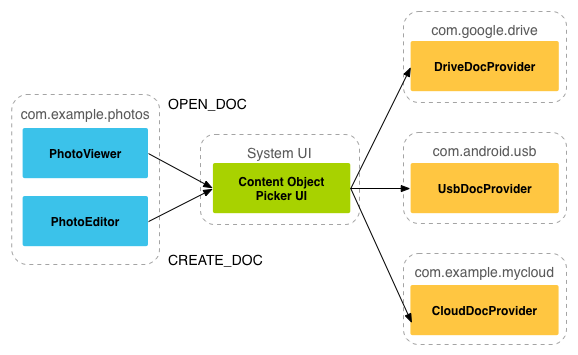

# Download 模块分析（三）--- 存储访问框架（SAF）

> 前两篇介绍了`DownloadManager`和`DownloadProvider`中的状态，在介绍`DocumentsUI`之前，需要先了解一下`SAF`框架。因为`SAF`框架是整个`DocuemntsUI`的实现基础。

### 背景
`Android`在`Kitkat`上剥夺了第三方应用程序对`SD Card`的写权限，使得一大批的应用程序不能够再使用外置的`SD Card`，此举招来了骂声一片，很多开发者都要求重新允许第三方应用获得`SD Card`的写权限。迫于压力，`Google`终于在`Lollipop`上`Android`又打开了一扇通往`SD Card`的大门: `Storage Access FrameWork`（`SAF`）—— 存储访问框架。

### SAF 介绍：
>`SAF` 让用户能够在其所有首选文档存储提供程序中方便地浏览并打开文档、图像以及其他文件。 用户可以通过易用的标准 `UI`，以统一方式在所有应用和提供程序中浏览文件和访问最近使用的文件。云存储服务或本地存储服务可以通过实现封装其服务的 `DocumentsProvider` 参与此生态系统。只需几行代码，便可将需要访问提供程序文档的客户端应用与 `SAF` 集成。

简单地说，应用程序可以借助`SAF`来浏览或者打开所有的文件。并且在`Lollipop`上还增加了选择目录并将其读写权限赋予应用的新功能。`SAF`的使用既简单又灵活：几句代码就可以实现文件的读取，而且你也可以实现自定义的`Privider`。也就是说，用户可以通过一个统一的界面，通过选择不同的渠道从不同的`provider`中读取数据（包括云存储服务）。

### SAF 内容

#### 架构：

首先引用官网`SAF`的架构图：


`SAF`大致由三部分组成：
- 客户端应用：一般指的是第三方应用。
- 选取器（`Picker`）：选取的系统`UI`，`Download`模块里特指`DocumentsUI`。
- 文档提供程序：内容提供者，也就是常说的`ContentProvider`， 文档提供程序作为`DocumentsProvider`类的子类实现。

#### 工作流程：
1. 第三方客户端向`Picker`请求直接与文件交互的权限，如`Intent.ACTION_OPEN_DOCUMENT`和`Intent.ACTION_CREATE_DOCUEMNT`：
  -  `Intent.ACTION_OPEN_DOCUMENT`: 对提供内容有长期、持久性访问权限。
  -  `Intent.ACTION_CREATE_DOCUEMNT`: 只对提供内容进行数据读取导入。
  -  `Intent.ACTION_GET_CONTENT`： 创建新文档。
2. `Picker`收到请求后，将从所有已注册的`provider`中寻找符合`intent`条件的数据源，并向用户展示内容。
3. 对内容进行选取后，此时用户可以与文件交互（即读取、编辑、创建或删除文件）。

这里不对`SAF`细节进行更多扩展，详细内容查看 [Android Developers](https://developer.android.google.cn/guide/topics/providers/document-provider.html?hl=zh-cn#overview)。

### 实现：

`SAF`实现关键类分别有`DocumentsContract`和`DocumentsProvider`。`DocumentsContract`作为和`DocumentsProvider`交互的契约类，客户端通过契约类的接口与`DocumentsProvider`进行进程间通讯，从而打开、删除、添加、编辑`provider`提供的文件。

**DocumentsProvider.java**

`DocumentsProvider`中采用传统的文件层次结构：


`DocumentsProvider`有以下特点：
* `DocumentsProvider`中至少存在一个`Root`根目录。每个根目录都有一个唯一的`COLUMN_ROOT_ID`，并且指向表示该根目录下内容的文档（目录）。根目录采用动态设计，以支持多个帐户、临时 USB 存储设备或用户登录/注销等用例；
* 每个根目录下都有一个`Document`。该`Document`指向「一个」或者「多个」`Document`，而其中每个`Document`又可指向「一个」或者「多个」`Document`；
* 每个`Document`的`ID`必须唯一；
* 每个文档都可以具有不同的功能，如`COLUMN_FLAGS`所述。例如，`FLAG_SUPPORTS_WRITE`、`FLAG_SUPPORTS_DELETE`和 `FLAG_SUPPORTS_THUMBNAIL`。多个目录中可以包含相同的`COLUMN_DOCUMENT_ID`。

`DocumentsProvider`是一个抽象类，其中有几个比较重要的方法：
* `queryRoots()`: 定义的列返回一个指向文档提供程序所有根目录的`Cursor`;
* `queryChildDocuments()`: 定义的列返回一个指向指定目录中所有文件的`Cursor`;
* `Cursor queryDocument()`: 定义的列返回一个指向指定文件的`Cursor`;
* `ParcelFileDescriptor queryDocument()`: 返回表示指定文件的`ParcelFileDescriptor`。

以「删除文档」作为例子：

``` java
// DocumentsContract.java
public static boolean deleteDocument(ContentResolver resolver, Uri documentUri)
            throws FileNotFoundException {
        final ContentProviderClient client = resolver.acquireUnstableContentProviderClient(
                documentUri.getAuthority());
        try {
          // 删除 document 记录
            deleteDocument(client, documentUri);
            return true;
        } catch (Exception e) {
            Log.w(TAG, "Failed to delete document", e);
            rethrowIfNecessary(resolver, e);
            return false;
        } finally {
            ContentProviderClient.releaseQuietly(client);
        }
    }
```

继续查看`deleteDocument(ContentProviderClient, Uri)`:

``` java
// DocumentsContract.java
public static void deleteDocument(ContentProviderClient client, Uri documentUri)
            throws RemoteException {
        final Bundle in = new Bundle();
        in.putParcelable(DocumentsContract.EXTRA_URI, documentUri);

        client.call(METHOD_DELETE_DOCUMENT, null, in);
    }
```

这里通过与`ContentProvider`进程间调用，调用`DocumentsProvider`中的方法`METHOD_DELETE_DOCUMENT`，也就是`deleteDocument()`。具体实现可以在`DocumentsProvider`的子类`FileSystemProvider`中找到：

``` java
  // DocumentsProvider.java
    public void deleteDocument(String docId) throws FileNotFoundException {
        final File file = getFileForDocId(docId);
        final File visibleFile = getFileForDocId(docId, true);

        final boolean isDirectory = file.isDirectory();
        if (isDirectory) {
            FileUtils.deleteContents(file);
        }
        if (!file.delete()) {
            throw new IllegalStateException("Failed to delete " + file);
        }

        removeFromMediaStore(visibleFile, isDirectory);
    }
```

可以看到先将文件夹内容删除，再删除文件夹本身，最后删除文件夹内容以及文件夹本身在`MediaStore`中的记录。

---

参考资料：
> http://zhixinliu.com/2015/02/24/2015-02-24-SAF-and-client-code/
> https://developer.android.google.cn/guide/topics/providers/document-provider.html?hl=zh-cn#overview
